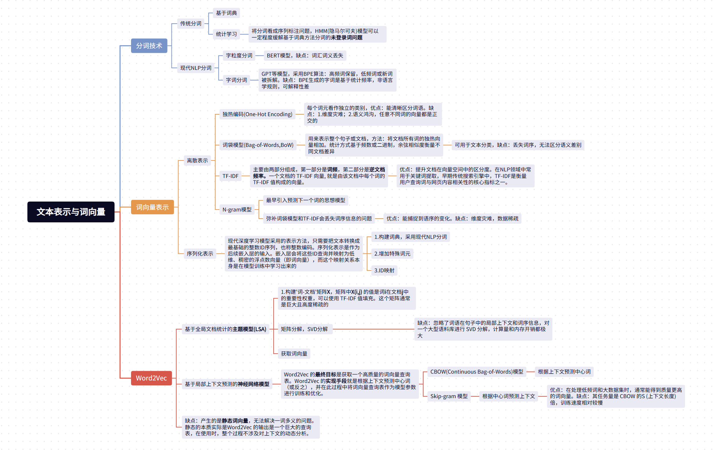
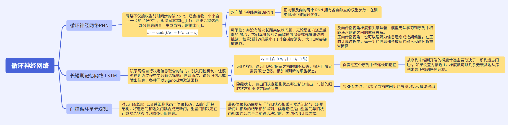
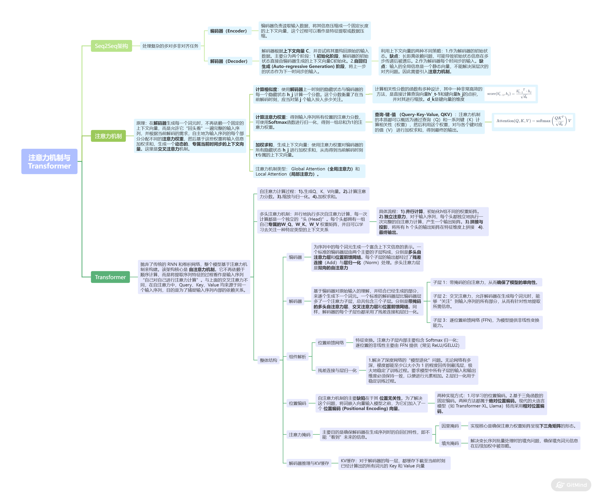
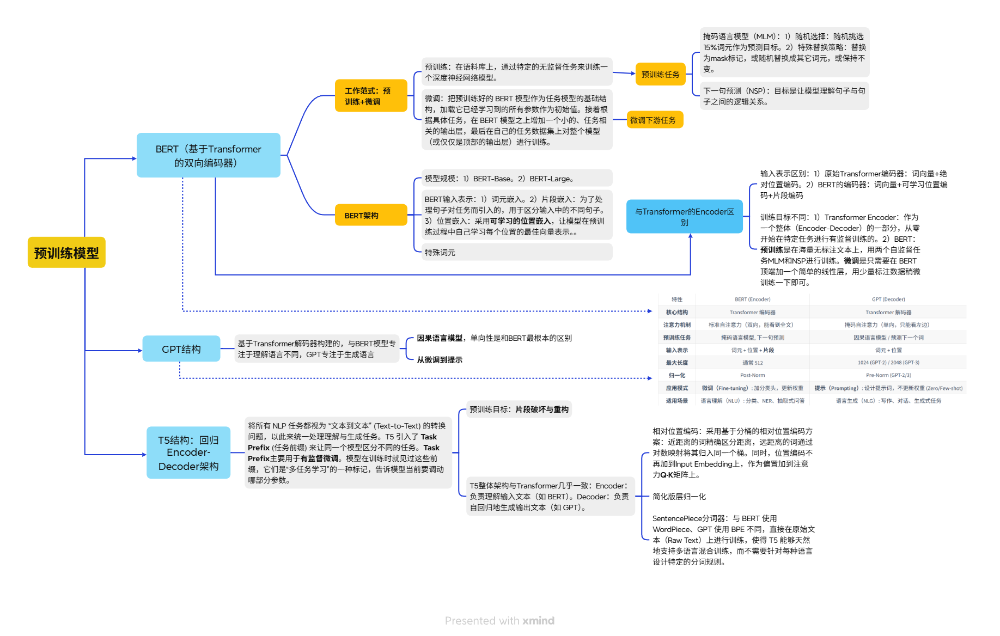

# llm算法学习笔记

### 文本表示与词向量思维导图

---

### 循环神经网络思维导图

---

### 注意力机制与Transformer思维导图

---

### 预训练模型思维导图

---

### Llama模型
输入在进入注意力层和前馈网络之前，会经过一次**RMS Norm**进行预归一化，

---

### 大模型归一化技术
在大型语言模型（LLM）的演进过程中，归一化（Normalization）技术至关重要，它能稳定深层网络的梯度，防止梯度消失或爆炸。

目前大模型中主要有以下几种归一化方案，按其技术演进和主流程度排列如下：

#### 1. Layer Normalization (LayerNorm / LN)
这是 Transformer 架构最初采用的方案（如 GPT-2、GPT-3）。

*   **原理**：对单个样本的所有特征维度（Channel）计算均值和方差，然后进行归一化。
*   **公式**：
    $$y = \frac{x - E[x]}{\sqrt{Var[x] + \epsilon}} \cdot \gamma + \beta$$
    *   $E[x]$ 是均值，使得分布中心移到 0。
    *   $Var[x]$ 是方差，使得分布缩放到 1。
    *   $\gamma$ 和 $\beta$ 是可学习的增益和偏置。
*   **特点**：独立于 Batch Size，非常适合处理变长序列。

#### 2. RMSNorm (Root Mean Square Layer Normalization)
这是**目前主流大模型（如 Llama 1/2/3, Mistral, Gopher）最常用的方案**。

*   **核心改进**：研究发现 LayerNorm 中的“中心化（减去均值）”作用不大，真正起作用的是“缩放（除以标准差）”。RMSNorm 舍弃了减去均值的步骤，只计算方差（均方根）。
*   **公式**：
    $$\bar{a}_i = \frac{a_i}{\sqrt{\frac{1}{n}\sum_{j=1}^n a_j^2 + \epsilon}} \cdot \gamma_i$$
*   **优点**：
        1.**计算更高效**：不需要计算均值，减少了约 10%~40% 的归一化计算开销。
        2.**更稳定**：在超大规模模型中表现出比标准 LN 更好的鲁棒性。

#### 3. DeepNorm
这是由微软提出的一种较新的方案，旨在解决超深网络（如 1000 层）的稳定性问题。

*   **特点**：它不仅是一种归一化公式，更是一套**归一化与残差连接结合**的初始化策略,类似于Post-LN。
*   **公式形式**：$x = \text{Norm}(\alpha \cdot x + \text{Network}(x))$。
*   **优势**：在增加模型深度时，它能保证梯度在反向传播时不会爆炸，使模型能够堆叠更多的层数而性能不退化（曾用于 GLM-130B 的早期版本）。

#### 4. 关键位置策略：Pre-LN vs. Post-LN
除了“用哪种归一化”，归一化放哪儿（位置）对模型影响更大：

*   **Post-LN (后归一化)**：
    *   结构：`Output = LayerNorm(x + SubLayer(x))`
    *   代表：BERT、原始 Transformer。
    *   **缺点**：梯度在靠近输出层的地方很大，在靠近输入层的地方很小，训练极不稳定，通常需要极其小心地调整 Learning Rate Warmup。
*   **Pre-LN (前归一化)**：
    *   结构：`Output = x + SubLayer(LayerNorm(x))`
    *   代表：**GPT-3、Llama、目前几乎所有主流 LLM**。
    *   **优点**：梯度流更加稳定，可以直接在训练初期使用较大的学习率，极大降低了收敛难度。

#### 总结对照表

| 方案 | 核心特点 | 代表模型 | 评价 |
| :--- | :--- | :--- | :--- |
| **LayerNorm** | 减均值、除方差 | GPT-3, BERT | 经典，但计算稍慢 |
| **RMSNorm** | 只除均方根，不减均值 | **Llama, Mistral** | **当前行业标准**，最快最稳 |
| **DeepNorm** | 结合残差缩放 | GLM-130B | 适合极深网络扩展 |
| **Pre-LN** | 归一化放在残差支路内 | 几乎所有主流大模型 | 训练稳定性的基石 |

**当前大模型的主流配置是：RMSNorm + Pre-LN。**
#### 5. 严格的递推公式（Pre-LN）

假设输入是 $x_0$，每一层的子层操作（比如 Attention 或 MLP）记为 $f_i$：

*   **第一层输出：**
    $$x_1 = x_0 + f_1(\text{Norm}(x_0))$$
*   **第二层输出：**
    $$x_2 = x_1 + f_2(\text{Norm}(x_1))$$
*   **第三层输出：**
    $$x_3 = x_2 + f_3(\text{Norm}(x_2))$$

如果我们把 $x_1$ 代入到 $x_2$ 的公式里，把 $x_2$ 代入到 $x_3$ 里，就会得到：

$$x_n = x_0 + f_1(\text{Norm}(x_0)) + f_2(\text{Norm}(x_1)) + f_3(\text{Norm}(x_2)) + \dots$$

**这个公式揭示了 Pre-LN 架构的三个核心真相：**

1.  **“主干道”逻辑：** 所有的 $f_i$（子层运算）其实都是在往一条**原始的信号长河 ($x_0$)** 里面“加料”。
2.  **累加性：** 最终的输出 $x_n$ 实际上是原始输入 $x_0$ 加上每一层算出来的“增量”之和。
3.  **理解的关键：** 每一层在计算时，看到的输入确实是**之前所有层累加的结果**，但在进入自己的核心运算前，它都会先用 `Norm` 把这个累加结果拉回到一个稳定的分布，防止这个“长河”变得太狂躁。
---
### 大模型FFN结构
在 Transformer 架构中，**前馈网络（Feed-Forward Network，简称 FFN）** 紧跟在自注意力机制（Self-Attention）之后。如果说注意力机制负责**信息交换**（让每个词看到别的词），那么 FFN 就负责**信息加工**（对每个词进行特征提取和知识检索）。FFN 占据了模型约 **2/3 的参数量**，是大模型存储“事实性知识”的核心仓库。以下是 FFN 的主流演进方案及其结构：
#### 1. 标准 FFN (ReLU FFN) —— 早期奠基者
这是原始 Transformer 和 GPT-2 使用的结构。

*   **结构：** 两个全连接层（Linear），中间夹一个 ReLU 激活函数。
*   **计算流程：**
    1.  **升维**：将维度从 $d$ 映射到 $4d$（通常是 4 倍，例如 1024$\rightarrow$4096）。
    2.  **激活**：使用 ReLU 函数过滤掉负信号。
    3.  **降维**：将维度从 $4d$ 映射回 $d$。
*   **公式：** $\text{FFN}(x) = \max(0, xW_1 + b_1)W_2 + b_2$
*   **评价：** 简单高效，但 ReLU 在 $x<0$ 时梯度为 0，容易导致部分神经元“死亡”且不再更新。

#### 2. GELU FFN —— GPT-3 的选择
随着研究深入，人们发现 ReLU 的“硬截断”太暴力，于是引入了更平滑的 **GELU (Gaussian Error Linear Unit)**。

*   **结构：** 与标准 FFN 一致，只是将 ReLU 换成了 GELU。
*   **计算流程：** 逻辑同上。
*   **公式：** $\text{FFN}(x) = \text{GELU}(xW_1)W_2$ $\quad$ $\text{GELU}(x) \approx x \cdot \sigma(1.702x)$
*   **评价：** GELU 在零点附近更平滑，且允许微弱的负值通过。它是 **BERT、GPT-3、ViT** 等经典模型的标配。
#### 3. GLU 家族与 SwiGLU —— 现代大模型（Llama）的标配
**SwiGLU** 是 **Swish** 激活函数与 GLU(门控线性单元)的结合体。
##### A. 什么是门控线性单元 (GLU)?
GLU 不再是一条路走到黑，而是分成了并行的**两条路**：
1.  **支路一（值支路）**：线性变换。
2.  **支路二（门控支路）**：线性变换 + 激活函数。激活函数是**Swish函数**：$$\text{Swish}(x) = x \cdot \sigma(\beta x) = \frac{x}{1 + e^{-\beta x}}$$
其中 $\sigma(x)$ 是 Sigmoid 函数，$\beta$ 是一个可学习的参数或常数。
当 $\beta = 1$ 时，Swish 就变成了 **SiLU**：
$$\text{SiLU}(x) = x \cdot \sigma(x) = \frac{x}{1 + e^{-x}}$$
3.  **合并**：两条路的结果**逐元素相乘**。
##### B. SwiGLU 结构详解
SwiGLU 是 GLU 的一种特例，使用 **Swish (SiLU)** 激活函数。这是 **Llama 2/3、Mistral、Gemma** 的共同选择。
*   **计算流程：**
    1.  **输入分裂**：输入 $x$ 分别经过两个权重矩阵 $W$ 和 $V$。
    2.  **门控运算**：对 $xW$ 分路进行 Swish 激活。
    3.  **融合**：将激活后的结果与 $xV$ 分路的结果相乘。
    4.  **投影**：最后通过 $W_2$ 映射回原维度。
*   **公式：** $\text{SwiGLU}(x) = (\text{Swish}(xW) \otimes xV)W_2$
*   **优点：** 表达能力极强。门控支路可以动态决定“哪些特征重要”，这比死板的 ReLU 过滤要聪明得多。

#### 4. MoE (Mixture of Experts) —— 混合专家模型
当模型想变得更强大但又不想增加推理成本时，就会使用 **混合专家模型（MoE）**。

*   **结构：** FFN 层不再是一个，而是 **N 个并排的 FFN（专家）**，上方有一个 **Router（路由器）**。
*   **代表：** **GPT-4、Mixtral 8x7B、DeepSeek-V2**。
*   **计算流程：**
    1.  **路由**：路由器根据输入的 Token，计算它与每个专家的匹配度。
    2.  **激活专家**：通常只选前 1~2 个最匹配的专家进行计算。
    3.  **加权求和**：将这 1~2 个专家的输出加权合并。
*   **优点：** 比如总参数有 100B，但每个 Token 经过时只激活 10B 的参数。实现了小模型的推理速度，大模型的知识容量。

#### 5. 总结对比表

| 结构名称 | 公式简述 | 核心特点 | 流行程度 |
| :--- | :--- | :--- | :--- |
| **Standard FFN** | $\text{ReLU}(W_1)W_2$ | 简单、经典 | 较低（已被淘汰） |
| **GELU FFN** | $\text{GELU}(W_1)W_2$ | 平滑激活 | 中（GPT-3 仍在使用） |
| **SwiGLU** | $(Swish(W) \otimes V)W_2$ | **门控控制，表达力极强** | **最高（Llama 系标配）** |
| **MoE** | $\sum \text{Gate}_i \cdot \text{FFN}_i$ | **稀疏激活，海量参数** | **未来趋势（高性能模型）** |

#### 补充：为什么 FFN 都要“先升维再降维”？

你会发现所有的 FFN 结构（除了 MoE 的路由逻辑）都有一个共同点：先扩大特征维度（通常扩到 4 倍或 8/3 倍），再缩回原样。
**原因**
1.  **空间换知识**：低维空间里信息太挤，无法进行复杂的非线性变换。把特征投射到高维空间，相当于给数据提供了更多的“思考位”，让模型能学习到更细致的特征组合。
2.  **模拟生物神经元**：这很像生物大脑，输入信号被投射到大量的神经元中进行处理，最后再总结成输出。
   
**当前大模型的主流配置：** **Pre-LN + RMSNorm + SwiGLU FFN**。最新的 Llama 3 源码，这三者构成了它最基础的层（Block）。

---

 ### 大模型位置编码

 在 Transformer 架构中，**位置编码（Positional Encoding/Embedding, PE）** 是至关重要的。

Self-Attention 本质上是**置换不变的（Permutation Invariant）**。如果不加位置信息，模型看“我爱吃蝉”和“蝉爱吃我”是一模一样的。为了让模型理解词序，我们必须人工注入位置信息。

位置编码的技术演进可以分为三个阶段：**绝对位置编码**、**相对位置编码**、以及现在的**旋转位置编码（RoPE）**。

#### 1. 绝对位置编码 (Absolute PE)
这是最早期、最直观的方案：直接给每个位置一个固定**坐标**。

##### A. 静态正弦编码 (Sinusoidal PE)
*   **代表**：原始 Transformer (Vaswani et al., 2017)。
*   **做法**：使用不同频率的 $\sin$ 和 $\cos$ 函数生成固定向量，直接加（Add）到词向量上。
*   **特点**：不需要学习参数，理论上能体现一定的相对位置关系。

##### B. 可学习绝对编码 (Learned Absolute PE)
*   **代表**：**GPT-2、GPT-3**、BERT。
*   **做法**：随机初始化一个位置矩阵（比如 $2048 \times d$），把位置 0、1、2... 当作词表一样去训练。
*   **缺点**：**外推性极差**。如果你训练时最大长度是 2048，推理时遇到 2049 个词，模型就完全不知道该怎么办了。

#### 2. 相对位置编码 (Relative PE)
模型其实并不关心某个词是在第 5 还是第 50 个，而更关心的是：**词 A 和词 B 之间离了多远**。

*   **代表**：T5、Transformer-XL。
*   **做法**：不再在词向量上加东西，而是在计算 Attention 分数（$QK^T$）时，根据 $i$ 和 $j$ 的距离 $(i-j)$ 额外加一个偏置项（Bias）。
*   **优点**：外推性好，模型能处理比训练时更长的序列。
*   **缺点**：计算复杂度高，推理时难以缓存（KV Cache 优化困难）。

#### 3. 旋转位置编码 (RoPE, Rotary PE)
这是目前 **Llama 2/3、Mistral、GLM、Qwen** 等几乎所有主流大模型使用的方案。

*   **结构逻辑**：
    1. 它不直接加在词向量上。
    2. 它通过一个**旋转矩阵**，把 Query (Q) 和 Key (K) 向量在复平面上旋转一定的角度。
    3. **旋转的角度取决于位置索引**。位置 $m$ 的旋转角度是 $m\theta$，位置 $n$ 是 $n\theta$。
*   **公式直觉**：
    两个旋转后的向量做点积时，结果只取决于它们之间的**角度差**：$(m\theta - n\theta) = (m-n)\theta$。
*   **优点**：
    1. **绝对形式实现相对关系**：虽然每个词是按绝对位置旋转的，但 Attention 计算出来却是相对位置效果。
    2. **外推性极强**：通过“线性插值”或“NTK-Aware”缩放，可以轻松将 4k 的上下文扩展到 32k 甚至 128k。
    3. **计算高效**

#### 4. ALiBi (Attention with Linear Biases) 
一些追求超长上下文的模型（如 Bloom、MPT）会采用这种方案。

*   **结构逻辑**：
    它非常粗暴——直接在 Attention Matrix 上减去一个正比于距离的惩罚值。
*   **公式**：$\text{Score} = QK^T - \lambda \cdot |i - j|$
*   **特点**：**零样本外推**。训练 1k 长度的模型，可以直接在 10k 长度上推理而不崩溃。它完全抛弃了“位置向量”的概念，只保留距离惩罚。

#### 5. 总结对照表

| 技术名称 | 核心逻辑 | 典型模型 | 优缺点总结 |
| :--- | :--- | :--- | :--- |
| **Learned PE** | 每个位置一个可学习向量 | GPT-3 | 简单，但不支持长文本外推 |
| **T5 Relative** | 在 Attention 分数加偏置 | T5 | 效果好，但推理计算复杂 |
| **RoPE** | **按位置旋转 Q/K 向量** | **Llama 1/2/3** | **完美平衡了效率和长文本外推** |
| **ALiBi** | 随距离增加线性惩罚 | MPT, Bloom | 极其强悍的外推能力，但短距离建模稍弱 |

#### 最终总结：为什么大模型偏爱 RoPE？

1. **Decoder-only 架构**（通用性）。
2. **RMSNorm + Pre-LN**（训练稳定性）。
3. **SwiGLU FFN**（知识容量）。
4. **RoPE 位置编码**（超长上下文处理能力）。

**RoPE 的精妙之处在于**：它通过数学上的复数旋转，巧妙地让模型既拥有了绝对位置的唯一性，又拥有了相对位置的灵活性。这就像给每个词发了一个带经纬度的指南针，无论序列多长，词与词之间的指向关系永远是清晰且连续的。

