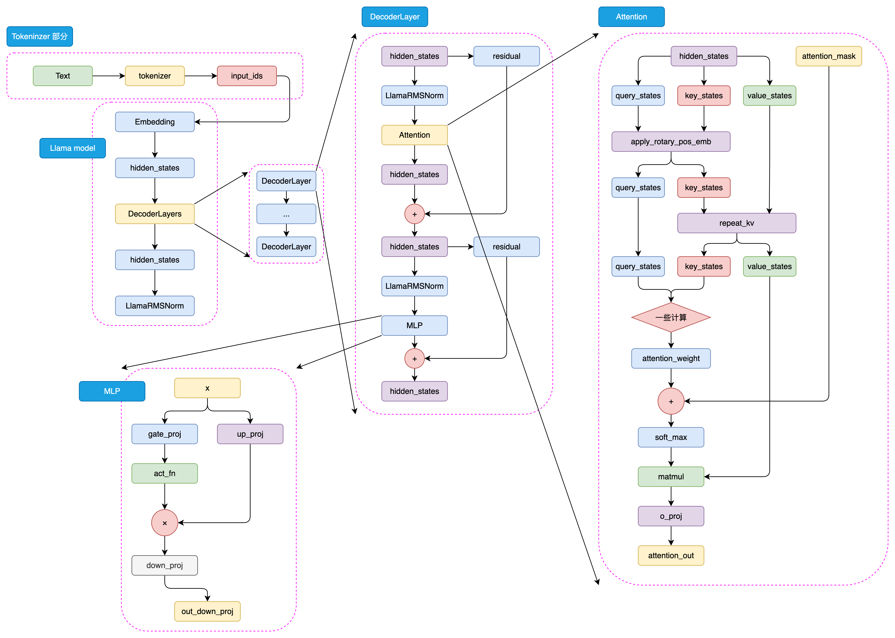
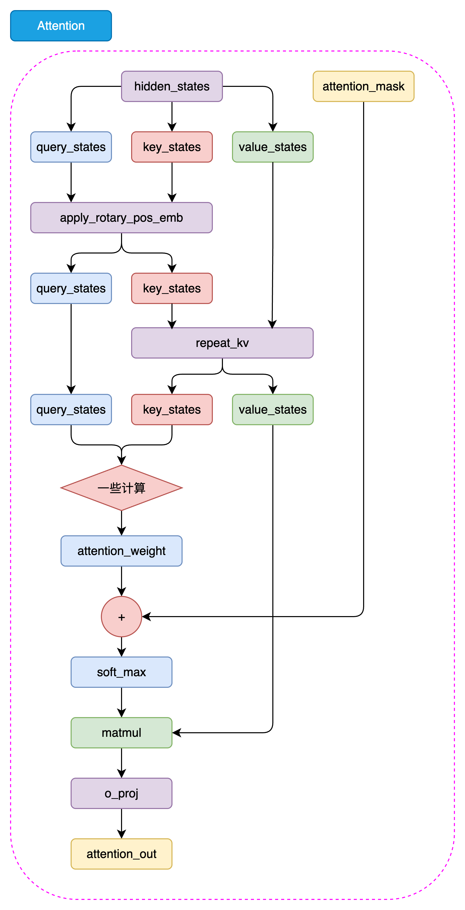

# llm算法学习笔记

### 文本表示与词向量思维导图

---

### 循环神经网络思维导图

---

### 注意力机制与Transformer思维导图

---

### 预训练模型思维导图

---

### Llama模型
Encoder（如 BERT） 和 Decoder-only（如 GPT） 在“理解prompt”阶段找一个最本质的数学区别，那就是：有没有那个**因果掩码（Causal Mask）**
#### Llama2架构

#### 🌟 Llama 2 标准计算流程图

**【输入准备阶段】**
1. 文本 $\rightarrow$ **Tokenizer** $\rightarrow$ Token IDs (整数序列)
2. Token IDs $\rightarrow$ **Embedding 层** $\rightarrow$ 初始词向量 $X$

**【Decoder Block 循环阶段】** *(假设重复 32 层)*
3. $X$ 备份一份用于稍后的残差连接。
4. **RMSNorm (前归一化)**：对 $X$ 进行归一化。
5. **线性投影**：将归一化后的数据映射为 $Q, K, V$ 向量。
6. **RoPE 位置编码**：只对 $Q$ 和 $K$ 进行旋转，注入位置信息。
7. **KV Cache 与 GQA/MHA**：如果有缓存则拼接前面的 $K, V$；通过注意力公式 $\text{Softmax}(\frac{QK^T}{\sqrt{d}})V$ 计算注意力。
8. **输出投影**：将注意力计算结果经过矩阵 $W_o$ 映射回原来维度。
9. **第一次残差连接**：初始 $X$ + 注意力输出 $\rightarrow$ 得到新的 $X$。
10. 新 $X$ 再次备份。
11. **RMSNorm (前归一化)**：对新 $X$ 进行归一化。
12. **前馈网络 (FFN)**：经过双支路门控机制的 **SwiGLU** 激活与升降维。
13. **第二次残差连接**：备份的 $X$ + FFN 输出 $\rightarrow$ 完成当前层的编码。

**【输出预测阶段】**
14. 走完所有 Decoder 层，得到最终的隐藏状态张量。
15. **全局 RMSNorm**：进行最后一次归一化，确保输出稳定。
16. **LM Head (线性映射)**：将高维张量投影到词表维度（Vocab Size）。
17. **Softmax**（如果是在推理阶段）：转化为概率，选出下一个词。

#### Llama2注意力架构

输入在进入注意力层和前馈网络之前，会经过一次**RMS Norm**进行预归一化

---

### 大模型归一化技术
在大型语言模型（LLM）的演进过程中，归一化（Normalization）技术至关重要，它能稳定深层网络的梯度，防止梯度消失或爆炸。

目前大模型中主要有以下几种归一化方案，按其技术演进和主流程度排列如下：

#### 1. Layer Normalization (LayerNorm / LN)
这是 Transformer 架构最初采用的方案（如 GPT-2、GPT-3）。

*   **原理**：对单个样本的所有特征维度（Channel）计算均值和方差，然后进行归一化。
*   **公式**：
    $$
    y = \frac{x - E[x]}{\sqrt{Var[x] + \epsilon}} \cdot \gamma + \beta
    $$
    *   $E[x]$ 是均值，使得分布中心移到 0。
    *   $Var[x]$ 是方差，使得分布缩放到 1。
    *   $\gamma$ 和 $\beta$ 是可学习的增益和偏置。
*   **特点**：独立于 Batch Size，非常适合处理变长序列。

#### 2. RMSNorm (Root Mean Square Layer Normalization)
这是**目前主流大模型（如 Llama 1/2/3, Mistral, Gopher）最常用的方案**。

*   **核心改进**：研究发现 LayerNorm 中的“中心化（减去均值）”作用不大，真正起作用的是“缩放（除以标准差）”。RMSNorm 舍弃了减去均值的步骤，只计算方差（均方根）。
*   **公式**：    
$$
\bar{a}_i = \frac{a_i}{\sqrt{\frac{1}{n}\sum_{j=1}^n a_j^2 + \epsilon}} \cdot \gamma_i
$$
*   **优点**：
        1.**计算更高效**：不需要计算均值，减少了约 10%~40% 的归一化计算开销。
        2.**更稳定**：在超大规模模型中表现出比标准 LN 更好的鲁棒性。

#### 3. DeepNorm
这是由微软提出的一种较新的方案，旨在解决超深网络（如 1000 层）的稳定性问题。

*   **特点**：它不仅是一种归一化公式，更是一套**归一化与残差连接结合**的初始化策略,类似于Post-LN。
*   **公式形式**：$$
x = \text{Norm}(\alpha \cdot x + \text{Network}(x))
$$。
*   **优势**：在增加模型深度时，它能保证梯度在反向传播时不会爆炸，使模型能够堆叠更多的层数而性能不退化（曾用于 GLM-130B 的早期版本）。

#### 4. 关键位置策略：Pre-LN vs. Post-LN
除了“用哪种归一化”，归一化放哪儿（位置）对模型影响更大：

*   **Post-LN (后归一化)**：
    *   结构：`Output = LayerNorm(x + SubLayer(x))`
    *   代表：BERT、原始 Transformer。
    *   **缺点**：梯度在靠近输出层的地方很大，在靠近输入层的地方很小，训练极不稳定，通常需要极其小心地调整 Learning Rate Warmup。
*   **Pre-LN (前归一化)**：
    *   结构：`Output = x + SubLayer(LayerNorm(x))`
    *   代表：**GPT-3、Llama、目前几乎所有主流 LLM**。
    *   **优点**：梯度流更加稳定，可以直接在训练初期使用较大的学习率，极大降低了收敛难度。

#### 总结对照表

| 方案 | 核心特点 | 代表模型 | 评价 |
| :--- | :--- | :--- | :--- |
| **LayerNorm** | 减均值、除方差 | GPT-3, BERT | 经典，但计算稍慢 |
| **RMSNorm** | 只除均方根，不减均值 | **Llama, Mistral** | **当前行业标准**，最快最稳 |
| **DeepNorm** | 结合残差缩放 | GLM-130B | 适合极深网络扩展 |
| **Pre-LN** | 归一化放在残差支路内 | 几乎所有主流大模型 | 训练稳定性的基石 |

**当前大模型的主流配置是：RMSNorm + Pre-LN。**
#### 5. 严格的递推公式（Pre-LN）

假设输入是 $x_0$，每一层的子层操作（比如 Attention 或 MLP）记为 $f_i$：

*   **第一层输出：**
    $$x_1 = x_0 + f_1(\text{Norm}(x_0))$$
*   **第二层输出：**
    $$x_2 = x_1 + f_2(\text{Norm}(x_1))$$
*   **第三层输出：**
    $$x_3 = x_2 + f_3(\text{Norm}(x_2))$$

如果我们把 $x_1$ 代入到 $x_2$ 的公式里，把 $x_2$ 代入到 $x_3$ 里，就会得到：

$$x_n = x_0 + f_1(\text{Norm}(x_0)) + f_2(\text{Norm}(x_1)) + f_3(\text{Norm}(x_2)) + \dots$$

**这个公式揭示了 Pre-LN 架构的三个核心真相：**

1.  **“主干道”逻辑：** 所有的 $f_i$（子层运算）其实都是在往一条**原始的信号长河 ($x_0$)** 里面“加料”。
2.  **累加性：** 最终的输出 $x_n$ 实际上是原始输入 $x_0$ 加上每一层算出来的“增量”之和。
3.  **理解的关键：** 每一层在计算时，看到的输入确实是**之前所有层累加的结果**，但在进入自己的核心运算前，它都会先用 `Norm` 把这个累加结果拉回到一个稳定的分布，防止这个“长河”变得太狂躁。
---
### 大模型FFN结构
在 Transformer 架构中，**前馈网络（Feed-Forward Network，简称 FFN）** 紧跟在自注意力机制（Self-Attention）之后。如果说注意力机制负责**信息交换**（让每个词看到别的词），那么 FFN 就负责**信息加工**（对每个词进行特征提取和知识检索）。FFN 占据了模型约 **2/3 的参数量**，是大模型存储“事实性知识”的核心仓库。以下是 FFN 的主流演进方案及其结构：
#### 1. 标准 FFN (ReLU FFN) —— 早期奠基者
这是原始 Transformer 和 GPT-2 使用的结构。

*   **结构：** 两个全连接层（Linear），中间夹一个 ReLU 激活函数。
*   **计算流程：**
    1.  **升维**：将维度从 $d$ 映射到 $4d$（通常是 4 倍，例如 1024 -> 4096）。
    2.  **激活**：使用 ReLU 函数过滤掉负信号。
    3.  **降维**：将维度从 $4d$ 映射回 $d$。
*   **公式：** $\text{FFN}(x) = \max(0, xW_1 + b_1)W_2 + b_2$
*   **评价：** 简单高效，但 ReLU 在 $x<0$ 时梯度为 0，容易导致部分神经元“死亡”且不再更新。

#### 2. GELU FFN —— GPT-3 的选择
随着研究深入，人们发现 ReLU 的“硬截断”太暴力，于是引入了更平滑的 **GELU (Gaussian Error Linear Unit)**。

*   **结构：** 与标准 FFN 一致，只是将 ReLU 换成了 GELU。
*   **计算流程：** 逻辑同上。
*   **公式：** $\text{FFN}(x) = \text{GELU}(xW_1)W_2$ $\quad$ $\text{GELU}(x) \approx x \cdot \sigma(1.702x)$
*   **评价：** GELU 在零点附近更平滑，且允许微弱的负值通过。它是 **BERT、GPT-3、ViT** 等经典模型的标配。
#### 3. GLU 家族与 SwiGLU —— 现代大模型（Llama）的标配
**SwiGLU** 是 **Swish** 激活函数与 GLU(门控线性单元)的结合体。
##### A. 什么是门控线性单元 (GLU)?
GLU 不再是一条路走到黑，而是分成了并行的**两条路**：
1.  **支路一（值支路）**：线性变换。
2.  **支路二（门控支路）**：线性变换 + 激活函数。激活函数是**Swish函数**：
$$
\text{Swish}(x) = x \cdot \sigma(\beta x) = \frac{x}{1 + e^{-\beta x}}
$$
其中 $\sigma(x)$ 是 Sigmoid 函数， $\beta$ 是一个可学习的参数或常数。
当 $\beta = 1$ 时，Swish 就变成了 **SiLU**：
$$
\text{SiLU}(x) = x \cdot \sigma(x) = \frac{x}{1 + e^{-x}}
$$
1.  **合并**：两条路的结果**逐元素相乘**。
##### B. SwiGLU 结构详解
SwiGLU 是 GLU 的一种特例，使用 **Swish (SiLU)** 激活函数。这是 **Llama 2/3、Mistral、Gemma** 的共同选择。
*   **计算流程：**
    1.  **输入分裂**：输入 $x$ 分别经过两个权重矩阵 $W$ 和 $V$。
    2.  **门控运算**：对 $xW$ 分路进行 Swish 激活。
    3.  **融合**：将激活后的结果与 $xV$ 分路的结果相乘。
    4.  **投影**：最后通过 $W_2$ 映射回原维度。
*   **公式：** $\text{SwiGLU}(x) = (\text{Swish}(xW) \otimes xV)W_2$
*   **优点：** 表达能力极强。门控支路可以动态决定“哪些特征重要”，这比死板的 ReLU 过滤要聪明得多。

#### 4. MoE (Mixture of Experts) —— 混合专家模型
当模型想变得更强大但又不想增加推理成本时，就会使用 **混合专家模型（MoE）**。

*   **结构：** FFN 层不再是一个，而是 **N 个并排的 FFN（专家）**，上方有一个 **Router（路由器）**。
*   **代表：** **GPT-4、Mixtral 8x7B、DeepSeek-V2**。
*   **计算流程：**
    1.  **路由**：路由器根据输入的 Token，计算它与每个专家的匹配度。
    2.  **激活专家**：通常只选前 1~2 个最匹配的专家进行计算。
    3.  **加权求和**：将这 1~2 个专家的输出加权合并。
*   **优点：** 比如总参数有 100B，但每个 Token 经过时只激活 10B 的参数。实现了小模型的推理速度，大模型的知识容量。

#### 5. 总结对比表

| 结构名称 | 公式简述 | 核心特点 | 流行程度 |
| :--- | :--- | :--- | :--- |
| **Standard FFN** | $\text{ReLU}(W_1)W_2$ | 简单、经典 | 较低（已被淘汰） |
| **GELU FFN** | $\text{GELU}(W_1)W_2$ | 平滑激活 | 中（GPT-3 仍在使用） |
| **SwiGLU** | $(Swish(W) \otimes V)W_2$ | **门控控制，表达力极强** | **最高（Llama 系标配）** |
| **MoE** | $\sum \text{Gate}_i \cdot \text{FFN}_i$ | **稀疏激活，海量参数** | **未来趋势（高性能模型）** |

#### 补充：为什么 FFN 都要“先升维再降维”？

你会发现所有的 FFN 结构（除了 MoE 的路由逻辑）都有一个共同点：先扩大特征维度（通常扩到 4 倍或 8/3 倍），再缩回原样。
**原因**
1.  **空间换知识**：低维空间里信息太挤，无法进行复杂的非线性变换。把特征投射到高维空间，相当于给数据提供了更多的“思考位”，让模型能学习到更细致的特征组合。
2.  **模拟生物神经元**：这很像生物大脑，输入信号被投射到大量的神经元中进行处理，最后再总结成输出。
   
**当前大模型的主流配置：** **Pre-LN + RMSNorm + SwiGLU FFN**。最新的 Llama 3 源码，这三者构成了它最基础的层（Block）。

---

 ### 大模型位置编码

 在 Transformer 架构中，**位置编码（Positional Encoding/Embedding, PE）** 是至关重要的。

Self-Attention 本质上是**置换不变的（Permutation Invariant）**。如果不加位置信息，模型看“我爱吃蝉”和“蝉爱吃我”是一模一样的。为了让模型理解词序，我们必须人工注入位置信息。

位置编码的技术演进可以分为三个阶段：**绝对位置编码**、**相对位置编码**、以及现在的**旋转位置编码（RoPE）**。

#### 1. 绝对位置编码 (Absolute PE)
这是最早期、最直观的方案：直接给每个位置一个固定**坐标**。

##### A. 静态正弦编码 (Sinusoidal PE)
*   **代表**：原始 Transformer (Vaswani et al., 2017)。
*   **做法**：使用不同频率的 $\sin$ 和 $\cos$ 函数生成固定向量，直接加（Add）到词向量上。
*   **特点**：不需要学习参数，理论上能体现一定的相对位置关系。

##### B. 可学习绝对编码 (Learned Absolute PE)
*   **代表**：**GPT-2、GPT-3**、BERT。
*   **做法**：随机初始化一个位置矩阵（比如 $2048 \times d$），把位置 0、1、2... 当作词表一样去训练。
*   **缺点**：**外推性极差**。如果你训练时最大长度是 2048，推理时遇到 2049 个词，模型就完全不知道该怎么办了。

#### 2. 相对位置编码 (Relative PE)
模型其实并不关心某个词是在第 5 还是第 50 个，而更关心的是：**词 A 和词 B 之间离了多远**。

*   **代表**：T5、Transformer-XL。
*   **做法**：不再在词向量上加东西，而是在计算 Attention 分数（$QK^T$）时，根据 $i$ 和 $j$ 的距离 $(i-j)$ 额外加一个偏置项（Bias）。
*   **优点**：外推性好，模型能处理比训练时更长的序列。
*   **缺点**：计算复杂度高，推理时难以缓存（KV Cache 优化困难）。

#### 3. 旋转位置编码 (RoPE, Rotary PE)
这是目前 **Llama 2/3、Mistral、GLM、Qwen** 等几乎所有主流大模型使用的方案。

*   **结构逻辑**：
    1. 它不直接加在词向量上。
    2. 它通过一个**旋转矩阵**，把 Query (Q) 和 Key (K) 向量在复平面上旋转一定的角度。
    3. **旋转的角度取决于位置索引**。位置 $m$ 的旋转角度是 $m\theta$，位置 $n$ 是 $n\theta$。
*   **公式直觉**：
    两个旋转后的向量做点积时，结果只取决于它们之间的**角度差**：$(m\theta - n\theta) = (m-n)\theta$。
*   **优点**：
    1. **绝对形式实现相对关系**：虽然每个词是按绝对位置旋转的，但 Attention 计算出来却是相对位置效果。
    2. **外推性极强**：通过“线性插值”或“NTK-Aware”缩放，可以轻松将 4k 的上下文扩展到 32k 甚至 128k。
    3. **计算高效**

#### 4. ALiBi (Attention with Linear Biases) 
一些追求超长上下文的模型（如 Bloom、MPT）会采用这种方案。

*   **结构逻辑**：
    它非常粗暴——直接在 Attention Matrix 上减去一个正比于距离的惩罚值。
*   **公式**：$\text{Score} = QK^T - \lambda \cdot |i - j|$
*   **特点**：**零样本外推**。训练 1k 长度的模型，可以直接在 10k 长度上推理而不崩溃。它完全抛弃了“位置向量”的概念，只保留距离惩罚。

#### 5. 总结对照表

| 技术名称 | 核心逻辑 | 典型模型 | 优缺点总结 |
| :--- | :--- | :--- | :--- |
| **Learned PE** | 每个位置一个可学习向量 | GPT-3 | 简单，但不支持长文本外推 |
| **T5 Relative** | 在 Attention 分数加偏置 | T5 | 效果好，但推理计算复杂 |
| **RoPE** | **按位置旋转 Q/K 向量** | **Llama 1/2/3** | **完美平衡了效率和长文本外推** |
| **ALiBi** | 随距离增加线性惩罚 | MPT, Bloom | 极其强悍的外推能力，但短距离建模稍弱 |

#### 最终总结：为什么大模型偏爱 RoPE？

1. **Decoder-only 架构**（通用性）。
2. **RMSNorm + Pre-LN**（训练稳定性）。
3. **SwiGLU FFN**（知识容量）。
4. **RoPE 位置编码**（超长上下文处理能力）。

**RoPE 的精妙之处在于**：它通过数学上的复数旋转，巧妙地让模型既拥有了绝对位置的唯一性，又拥有了相对位置的灵活性。这就像给每个词发了一个带经纬度的指南针，无论序列多长，词与词之间的指向关系永远是清晰且连续的。

**RoPE 位置编码计算流程**
1. 预计算旋转频率
2. 生成原始Q和K向量，添加旋转
3. 计算注意力分数
4. 反向传播
*   **维度分配**：假设128 维的向量，每 2 维组成一个复数平面（子空间），总共有 64 个子空间。
*   **频率分配**：这 64 个子空间并不是旋转同样的角度。
    *   第 1 个子空间转得**最快**（ $\theta_0$ 较大，捕捉超近距离）。
    *   第 64 个子空间转得**最慢**（ $\theta_{63}$ 极小，捕捉超长距离）。

##### 如果只看其中一个 2 维子空间：
*   **原始（没转前）的点积**： $q_1 k_1 + q_2 k_2$
*   **RoPE 旋转后的点积**：
    $$\text{Score} = (q_1 k_1 + q_2 k_2) \cos((m-n)\theta) + (q_1 k_2 - q_2 k_1) \sin((m-n)\theta)$$

---

### 大模型分词器（Tokenizer）

它的任务是将人类无穷无尽的自然语言文本，切分成机器能理解的有限个“基础单元（Token）”，并映射成整数 ID。

可以把 Tokenizer 的技术演进分为三个阶段

在现代 Tokenizer 出现之前，NLP 领域走过两个极端：

*   **路线 A：Word-level（词级别）**
    *   **做法**：遇到空格就切分。比如 “I love playing games” $\rightarrow$ `["I", "love", "playing", "games"]`。
    *   **致命缺点 (OOV 问题)**：英文单词有各种时态（play, plays, playing, played），如果词表只存了 5 万个词，遇到没见过的词（比如一个新的网络梗），就只能把它变成 `<UNK>`（未知词）。这会丢失大量信息。
*   **路线 B：Character-level（字符级别）**
    *   **做法**：把所有文本拆成单个字母或汉字。比如 “apple” $\rightarrow$ `["a", "p", "p", "l", "e"]`。
    *   **致命缺点 (缺乏语义且太长)**：单个字母“a”毫无意义，模型很难学习。更可怕的是，这会让输入序列（Sequence Length）变得极长！原来算 1 个词的注意力，现在要算 5 个字母的注意力，计算量呈平方级爆炸。

**终极解法：Subword（子词）分词法**
*   介于词和字符之间。把常见的词当作一个整体，把不常见的罕见词拆成词根或字母。
*   **效果**：`"unbelievable"` $\rightarrow$ `["un", "believ", "able"]`。既保留了语义（前缀/词根/后缀），又控制了词表大小，**彻底消灭了 OOV（未知词）问题**。

#### 1. 三大核心 Subword 算法

目前大模型主流的 Subword 算法有三种，它们代表了不同的“切词哲学”。

##### ① BPE (Byte Pair Encoding, 字节对编码)
**代表模型**：GPT 系列（GPT-3/4）、Llama 系列、Qwen 等绝大多数大模型。
*   **哲学**：**“统计学做加法”**（自底向上）。
*   **流程**：
    1. 最开始，词表里只有基础的单个字符（比如 `a, b, c...`）。
    2. 统计语料库里**相邻出现频率最高**的两个符号。比如发现 `e` 和 `r` 经常连在一起出现。
    3. 把它们合并成一个新的 Token：`er`，并加入词表。
    4. 继续统计，发现 `t` 和 `h` 经常相邻，合并为 `th`；发现 `th` 和 `e` 经常相邻，合并为 `the`。
    5. 一直重复合并，直到词表达到你设定的大小（比如 Llama 的 32000，GPT-4 的 100000）。
*   **特点**：极度依赖频率。越常见的词，越可能作为一个完整的 Token 存在；越罕见的词，越会被拆碎。

##### ② WordPiece —— BERT 时代的标配
**代表模型**：BERT。
*   **哲学**：**“概率最大化”**。
*   **与 BPE 的区别**：
    BPE 是看两个字符组合出现的**绝对频次**。而 WordPiece 是看合并这两个字符，能否**最大程度地增加语言模型对整个训练数据的概率（似然值）**。
    简单来说：如果 `A` 和 `B` 本身都很常见，它们凑在一起也很常见，WordPiece 可能不合并它们（因为独立存在也合理）；但如果 `A` 和 `B` 很少单独出现，总是绑定在一起，WordPiece 就会优先合并它们。
*   **标志性特征**：它切出来的子词，如果不是单词的开头，前面会带上 `##`。比如 `["play", "##ing"]`。

##### ③ Unigram —— “做减法”的艺术
**代表模型**：T5、ALBERT。
*   **哲学**：**“自顶向下做减法”**。
*   **流程**：
    1. 不像 BPE 从字母开始，Unigram 一上来先搞一个巨大无比的词表（包含所有词和大量子词，比如 100 万个）。
    2. 评估每个 Token 的“重要性”（如果把它从词表里删掉，模型的整体损失会增加多少）。
    3. 把那些最不重要的 Token 剔除掉（比如一次删 10%）。
    4. 重复这个过程，直到词表缩小到目标大小（比如 32000）。
*   **特点**：它通常不单独使用，而是内置在 SentencePiece 这样的框架中。

#### 2. BBPE (Byte-Level BPE)

如果你用普通的 BPE，遇到完全没见过的语言（比如某种非洲小语种）或者奇怪的 Emoji 表情 🐶，词表里没有对应的字符，还是会报 `<UNK>` 错误。

**OpenAI 在 GPT-2 提出了一个天才的想法：Byte-Level BPE (BBPE)。**
既然计算机底层全都是二进制字节（Byte），而 1 个字节只有 256 种可能的取值（$2^8$）。
*   **做法**：我们将基础词表设为 **256 个字节**。不管你输入的是英文、中文、阿拉伯文，还是 Emoji，统统先转成 UTF-8 字节流。然后在这个字节流上进行 BPE 合并。
*   **结果**：**实现了真正意义上的 100% 无 OOV！** 模型可以编码全宇宙任何可以被计算机存储的符号。
*   现在几乎所有先进的大模型（GPT-4, Llama）底层都是 BBPE。

#### 3. 工业级实现框架

很多人会把分词算法和分词工具混淆，其实工业界主要用两大分词库：

1.  **SentencePiece (由 Google 开发)**
    *   它是 Llama, Mistral, GLM 等开源模型的标配。
    *   **特点**：它把空格也当作一个特殊的字符（通常显示为 `_` 或者是 ` `）。比如 `Hello World` 会切成 `[Hello, _World]`。它能完美还原带空格的文本，不需要像其他工具那样写复杂的正则预处理。它可以选择使用 BPE 或 Unigram 算法。
2.  **Tiktoken (由 OpenAI 开发)**
    *   它是 GPT-3.5/GPT-4 系列专用的分词器。
    *   **特点**：**极致的快！** 采用 Rust 编写，针对 BBPE 进行了极其变态的速度优化。GPT-4 的词表大小是 100k，用了非常复杂的正则预处理规则来避免把不同的逻辑块合并在一起。

#### 4. Tokenizer 总结对比表

| 维度 | BPE (Byte Pair Encoding) | WordPiece | Unigram |
| :--- | :--- | :--- | :--- |
| **构建逻辑** | 自底向上（频率合并） | 自底向上（概率提升） | 自顶向下（裁剪大词表） |
| **基础单元** | 字符 (Char) 或 字节 (Byte) | 字符 (Char) | 巨大的候选子词集合 |
| **典型代表** | **GPT-4, Llama 3, Qwen** | BERT | T5, ALBERT |
| **主流框架实现** | **Tiktoken, SentencePiece** | HuggingFace Tokenizers | SentencePiece |

#### 💡 一个关于架构的联动思考：词表大小 (Vocab Size) 的代价

当我们设计 Tokenizer 时，我们会纠结要把 `vocab_size` 设多大（Llama 2 是 32000，GPT-4 是 100000，Qwen 2 甚至达到了 151643）。

*   **词表大**：每个 Token 包含的信息多，一段长文本切出来的 Token 数量就少。这能**省上下文窗口长度，加快推理速度**。
*   **词表大带来的代价（联动上一个知识点）**：
    输出阶段最后的**线性映射 LM Head** ，它的矩阵大小是 `[vocab_size, hidden_dim]`。
    如果你的词表从 3 万扩大到 15 万，这个 LM Head 矩阵的参数量会**暴增 5 倍**！同时最底层的 Embedding 层参数也会暴增 5 倍。这会急剧增加模型的总参数量和显存占用。

---

### 大模型优化器技术

#### 第一部分：深度解剖绝对霸主 —— AdamW 的数学灵魂

要理解大模型优化，必须彻底搞懂 AdamW 到底在算什么。它之所以能统治大模型时代，是因为它同时解决了**“方向震荡”**、**“步长失控”**和**“权重衰减失效”**三大难题。

假设当前计算出的真实梯度（坡度）为 $g_t$。

##### 1. 一阶矩估计 $m_t$（动量：解决方向震荡）
$$m_t = \beta_1 m_{t-1} + (1 - \beta_1) g_t$$
*   **物理意义**：它不仅看当前的坡度 $g_t$，还保留了之前下山的“惯性” $m_{t-1}$（$\beta_1$ 通常取 0.9）。
*   **作用**：如果当前梯度突然指向一个诡异的悬崖，过去的惯性能把它拉回来，保证大方向的平滑。

##### 2. 二阶矩估计 $v_t$（自适应学习率：解决步长失控）
$$v_t = \beta_2 v_{t-1} + (1 - \beta_2) g_t^2$$
*   **物理意义**：它计算的是梯度的“剧烈程度（方差）”。如果某个参数频繁剧烈变动，$v_t$ 就会非常大（$\beta_2$ 通常取 0.95 或 0.999）。
*   **作用**：在更新时，步长会**除以 $\sqrt{v_t}$**。这意味着：**越是剧烈波动的参数，我越要压制它的更新幅度；越是一直死水微澜的参数，我越要放大它的更新幅度。**

##### 3. 为什么一定要加上“W” (Weight Decay 解耦)
*   **传统的 Adam（错误做法）**：把 L2 正则化（惩罚过大的参数）直接加到梯度 $g_t$ 里。结果这个惩罚项在除以 $\sqrt{v_t}$ 时被稀释了，导致模型容易过拟合。
*   **AdamW（正确做法）**：参数更新完之后，**强行按比例直接缩小参数本身**：
    $$\theta_{t} = \text{Adam更新后的参数} - \eta \lambda \theta_{t-1}$$
    （$\eta$ 是学习率，$\lambda$ 是衰减系数）。这一刀切得极其干净利落，是大模型泛化能力极强的根基。

#### 第二部分：优化器的灵魂伴侣 —— 学习率调度器 (LR Scheduler)

优化器只决定“怎么迈步”，但“步子到底迈多大”是由调度器决定的。大模型训练对学习率极其敏感。

##### 1. Warmup（预热阶段）
*   **做法**：在训练的前几千步，学习率从 0 慢慢爬升到最大值。
*   **原因**：刚开局时，模型参数全是随机初始化的。如果在悬崖边上直接给一个全速的学习率，模型会瞬间向错误方向迈出一大步，导致 Loss 爆炸（变成 NaN）。Warmup 让模型先“小步试探”，等适应了地形再全速奔跑。

##### 2. Cosine Decay（余弦衰减：寻找最深谷底）
*   **做法**：到达最大值后，学习率按照余弦曲线平滑、缓慢地下降，直到训练结束时趋近于 0。
*   **原因**：到了训练后期，模型已经接近最优解的“谷底”。如果步子还是很大，就会在谷底来回震荡跳不进去。余弦衰减让它在最后阶段能“精雕细琢”。

##### 3. WSD 调度 (Warmup-Stable-Decay) —— Llama 3 的秘密武器
这是目前最火的调度策略。
*   **做法**：预热之后，**保持最高学习率走一条极其漫长的平直线（Stable）**，直到数据快喂完了，才在最后 10% 的时间里垂直跳水（Decay）。
*   **为什么 Llama 3 用它？**：因为传统的 Cosine Decay 强绑定了“训练步数”。一旦你发现数据不够，想再加数据继续训，曲线就被破坏了。而 WSD 允许你**“无限续杯”**，只要数据没用完，就在 Stable 阶段一直训，想结束时随时触发 Decay 即可。它极大地增强了持续预训练（Continual Pre-training）的能力。

#### 第三部分：大模型时代的“保命符”黑科技

除了 AdamW，底层的工程优化还必须包含以下两项安全机制：

##### 1. 梯度裁剪 (Gradient Clipping)
*   **危机**：大模型由于层数极深（如 80 层），在反向传播时很容易出现某些极个别词语导致梯度瞬间被放大几万倍（梯度爆炸）。
*   **抢救手段**：在优化器更新前，强行计算所有梯度的 L2 范数（总长度）。如果超过设定阈值（比如 1.0），就把所有梯度等比例**暴力缩短**。
*   **大白话**：“不管你算出来的坡有多陡，你这一步最多只能跨 1 米！”这几乎是所有大模型不崩溃的底线。

##### 2. 混合精度与梯度缩放 (Grad Scaler)
*   为了省显存，大模型通常用半精度（FP16/BF16）训练。
*   **危机**：FP16 能表示的最小正数是 $6 \times 10^{-5}$。很多微小的梯度算出来比这个值还小，直接变成了 0（梯度下溢，Underflow），模型学了个寂寞。
*   **抢救手段**：在反向传播前，故意把 Loss 乘以一个巨大的数（比如 65536）。这样算出来的梯度也被放大了 65536 倍，全在 FP16 的安全范围内。等优化器更新参数前，再把梯度除以 65536 还原。

#### 第四部分：最前沿的颠覆性优化器 (Next-Gen Optimizers)

由于 AdamW 显存占用太高，业界在 2024 年前后爆发了一批试图“杀死 AdamW”的新星：

##### 1. GaLore (Gradient Low-Rank Projection)
*   **痛点**：AdamW 需要和权重矩阵一样大的显存来存状态。
*   **黑科技**：既然 LoRA 证明了模型的改变量是“低秩”的（主要信息集中在少数几个维度）。GaLore 直接把庞大的梯度矩阵“投影”压缩成一个极小的低秩矩阵，然后在这个小矩阵上跑 Adam 优化器，最后再反投影回大矩阵。
*   **震撼结果**：**无需 8-bit 量化，就能生生省下 70% 的优化器显存！** 让用消费级显卡（如 RTX 4090）从头预训练 7B 大模型成为可能。

##### 2. Sophia (Second-order Optimizer)
*   **痛点**：Adam 只是估算梯度的方差（一阶信息的变形）。
*   **黑科技**：Sophia 引入了**二阶导数（海森矩阵 Hessian）的对角线估计**。它不仅知道“坡有多陡（一阶）”，还知道“坡是凹的还是凸的、曲率是多少（二阶）”。它巧妙地通过极低成本的随机抽样算出了对角海森矩阵。
*   **震撼结果**：在 LLM 预训练上，**比 AdamW 速度快 2 倍，且 Loss 更低**，有望成为下一代大规模预训练的王者。

##### 3. Schedule-Free Optimizers (免调度优化器，由 Meta 等提出)
*   **痛点**：我们刚才提到，调 Cosine Decay 和 WSD 的超参数简直是炼丹，极其痛苦。
*   **黑科技**：2024 年最新的研究，通过对模型参数在训练过程中进行动态的“平均化（Averaging）”操作，在数学上彻底消灭了对学习率调度器（LR Scheduler）的依赖。
*   **震撼结果**：你不再需要设置 Warmup 和 Decay 步数了！模型随时处于“可停止可用”的状态，大幅降低了训练大模型的调参门槛。

#### 总结
大模型的优化器技术已经从单纯的“数学算法”演变成了一门**“数学+系统工程”**的复合学科。
*   **AdamW** 依然是跳动的心脏；
*   **WSD 调度、梯度裁剪** 是它的外骨骼；
*   而 **GaLore 和 Sophia** 等后起之秀，正在为降低大模型训练成本、突破极限算力而冲锋陷阵。

